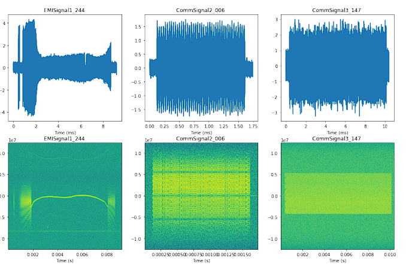

# Single-Channel-RF-Challenge

### Одноканальний RF-челендж  
MIT (e-mail: rfchallenge@mit.edu)

### I. Вступ

З поширенням бездротових технологій різні типи пристроїв можуть використовувати одну і ту ж частину радіочастотного спектра. У ситуації, коли є одночасний знімок кількох сигналів, що працюють одночасно, може бути необхідно розділити їх на відповідні компоненти для подальшого аналізу та характеристики. Крім того, бездротові пристрої, що працюють в одному частотному діапазоні, можуть відчувати порушення через інтерференцію (як навмисну, так і випадкову). Наприклад, шум від мікрохвильової печі працює в тому ж діапазоні ISM на 2.4 ГГц, що й декілька класів бездротових сигналів (наприклад, 802.11 WiFi, Bluetooth), і тому може викликати перешкоди для таких комунікаційних систем. Таким чином, або розділення сигналів, або зменшення перешкод допомогли б виділити сигнал-інтересу з потенційно вищою точністю, що, в свою чергу, покращить його демодуляцію та декодування.

Останні зусилля в області розділення джерел показали, що методи машинного навчання можуть бути ефективно використані в таких галузях, як комп'ютерний зір і аудіо. Проте в цих сферах алгоритми можуть використовувати той факт, що компоненти можуть бути розділені в просторі (наприклад, зображення), часі або частоті (наприклад, аудіо). У контексті RF сигналів, якщо компоненти можна розділити в часі та/або частоті, можна спробувати визначити різні компоненти через спектрограму суміші сигналів та розділити їх за допомогою маскування та традиційних методів фільтрації.

### A. Завдання челенджу

Основна проблема полягає в обробці **спільно-канальних сигналів** (co-channel signals), де компоненти перекриваються (частково або повністю) у часі та частоті. Нас цікавить:

- a) розділення спільно-канальних сигналів;
- b) демодуляція сигналу-інтересу в присутності інших завадових сигналів.

Відмінності в характеристиках спільно-канальних RF сигналів від сигналів у інших галузях (наприклад, зображеннях чи аудіо) вимагають дослідження та розробки нових методів. Зокрема, методи для RF сигналів повинні враховувати інші особливості, які не обов'язково легко ідентифікуються у стандартному аналізі часо-частотної області — для розділення сигналів.

Чи можуть методи на основі даних виявляти структури сигналів, корисні для розділення та/або демодуляції?

Розробка такого інструмента для розділення сигналів та/або зменшення інтерференцій може бути корисною у багатьох застосуваннях. Маючи більш точну оцінку складових компонентів, це може допомогти у наступних етапах обробки, таких як виявлення аномалій або детальніша класифікація. З точки зору комунікацій, така можливість може стати доповненням до етапів рівняння каналу перед стандартною демодуляцією та декодуванням, використовуючи знання про ймовірні інтерференції, отримані з прикладів.

### B. Рекомендації щодо розробки

Для забезпечення масштабованої розробки учасникам рекомендовано враховувати наступні аспекти в архітектурі:

- **Залежність мінімуму від конкретних специфікацій сигналів**: конкретні характеристики різних типів сигналів повинні бути враховані відповідними моделями у кроці розділення сигналів/зменшення інтерференцій.
- **Принципова незмінність алгоритму**: коли аналізується нова суміш двох різних класів сигналів (які можуть бути ідентифіковані іншими техніками), для кожного класу компонентів може використовуватися окрема модель, але загальна структура алгоритму повинна залишатися майже незмінною.
- **Можливість роботи з новими типами сигналів**: рішення повинно враховувати ситуацію, коли вводиться новий тип сигналу, і необхідно проаналізувати суміш цього нового сигналу з раніше відомими типами з мінімальним або без повторного навчання.

Ці вимоги допоможуть створити ефективний інструмент для розділення RF сигналів та демодуляції в умовах завад.

### Рис. 1: Представницькі кадри трьох типів сигналів із набору даних – Ліворуч: EMISignal1, По центру: CommSignal2, Праворуч: CommSignal3; Зверху: Графік реальної частини хвильових форм; Знизу: Спектрограма відповідних кадрів.

Набір даних містить файли із хвильовими формами для кожного з типів сигналів. Тривалість кожного кадру є сталою для одного типу сигналу, але відрізняється між різними типами (9.2 мс для **EMISignal1**, 1.7424 мс для **CommSignal2** і 10.4 мс для **CommSignal3**; всі вимірювання виконані з частотою дискретизації 25 МГц). 

Відповідні кадри були отримані з радіоефірних записів і нормалізовані до одиничної потужності для кожного кадру. Крім того, сигнали **EMISignal1** були зміщені по частоті таким чином, щоб основна частина енергії лежала в діапазоні базових частот. Це було досягнуто шляхом знаходження пікової частоти у спектральній щільності потужності кожного кадру (методом Велча) та зсуву цієї частоти до нуля.

Кожен кадр збережено у форматі **SigMF** [1]. Відповідні метадані кожного файлу містять інформацію про масштабування та зсуви, застосовані до кадрів, отриманих із необроблених записів.

Ці кадри використовуються для генерування суміщених сигналів, які застосовуються для завдання розділення та демодуляції; деталі щодо цих сумішей наведені в наступному розділі. Для кожного типу сигналу виділено 50 кадрів для формування тестового набору для фінальної оцінки. Решта кадрів зібрано для формування тренувального набору (**train_frame**), який містить приклади індивідуальних типів сигналів. Також надано «валидаційний набір», який згенеровано на основі останніх 50 кадрів кожного типу сигналу з тренувального набору; процес генерування цього валидаційного набору збігається з процесом для тестового набору.

Тестовий набір не буде випущений на старті виклику; більше деталей буде надано ближче до дати оцінювання.

### III. ВИКЛИКИ

**Підсумок запропонованих викликів**

- **Виклик розділення**
  - **Мета**: Розробити алгоритм машинного навчання, який зможе відновити високоточні реконструкції окремих сигналів, що передаються на одному каналі, з їхніх суміщень.
  - **Метрика оцінки**: середньоквадратична похибка (MSE) між «істинними» хвильовими формами та отриманими реконструкціями.
  - **Суміш**: CommSignal2 + перешкоди (або EMISignal1, або CommSignal3).
  - **Додаткова метрика**: Коефіцієнт помилок у пакетах (PER), отриманий шляхом передачі оцінки компонента CommSignal2 до стандартного демодулятора і перевірки цілісності через циклічний контроль надлишковості (CRC).

- **Виклик демодуляції**
  - **Мета**: Розробити алгоритм машинного навчання, який зможе відфільтровувати перешкоди для захисту приймача сигналів.
  - **Метрика оцінки**: коефіцієнт помилок у бітах (BER) на сигналі QPSK як функція відношення сигнал-шум-перешкоди (SINR).
  - **Суміш**: сигнал QPSK + перешкоди (або EMISignal1, або CommSignal2, або CommSignal3).
  - **Додаткова метрика**: Бінарна крос-ентропія (Log-Loss), особливо для оцінки складніших умов.

---

### IV. ЗАВДАННЯ 1: ВИКЛИК РОЗДІЛЕННЯ

У цьому виклику розглядаються ситуації, коли отримана хвильова форма є сумою кількох компонентів. У такому випадку нас може цікавити розділення вихідних джерел, щоб отримати оцінку хвильової форми для відповідних компонентів. Високоточна реконструкція кожного компонента може допомогти в подальшій обробці або аналізі окремих джерел (наприклад, декодування через стандартний демодулятор).

**Генерація тестових суміщень для виклику розділення**

Розглядається суміш сигналів \( y \in \mathbb{C}^{40960} \), яка є сумою двох компонентів:

\[
y = s + b,
\]

де \( s \) — це цифровий комунікаційний сигнал (CommSignal2), а \( b \) — сигнал-перешкода (або EMISignal1, або CommSignal3).

Для кожного з цих компонентів спочатку випадковим чином вибирається кадр відповідного типу сигналу з набору даних (описаного в розділі II), і з нього вибирається випадковий блок із 40,960 зразків. Потім кожен компонент масштабується для досягнення цільового відношення сигнал-шум-перешкоди (SINR). (Рис. 2)

Зокрема, блок CommSignal2 масштабується так, щоб його потужність відповідала нормі \( \|s\|^2_2 = 1 \), а блок перешкоди (EMISignal1 або CommSignal3) масштабується для досягнення цільового рівня SINR, тобто

\[
\frac{\|s\|^2_2}{\|b\|^2_2} = \text{Target SINR}.
\]

**Примітка 1**: Для полегшення обчислень \( s \), який сам по собі містить деякий шум, масштабується до потужності сигналу 1. Також SINR тут відноситься до відношення потужності сигналу \( s \) до перешкод \( b \), попри те, що \( s \) також містить фоновий шум.

Емпірично, записи \( s \) мають відношення сигнал-шум близько 17 дБ. Щоб врахувати наявний шум у \( s \), фактичне SINR можна наближено розрахувати як:

\[
\text{Фактичний SINR} \approx \frac{P_s - P_n}{P_n + P_b} \approx 0.98 \cdot \text{SINR}.
\]

**Примітка 2**: У тестовому наборі принаймні один із компонентів вибирається з невидимої частини набору даних, що була відкладена. Інший компонент може бути вибраний із кадру, що знаходиться в тренувальному наборі; однак, суміш все одно буде новою реалізацією, яку не бачили під час тренування.

**Метрика розділення**

Задача полягає в тому, щоб на основі даних **y** розробити алгоритми для оцінки двох компонентів: \(\hat{s}\) та \(\hat{b}\). Для оцінки ефективності використовують метрику середньоквадратичної похибки (MSE) для компонентів. У даному виклику основна увага приділяється відновленню компоненти **s** (сигнал CommSignal2). Формула для MSE виглядає так:

\[
MSE(\hat{s}, s) = \|\hat{s} - s\|^2_2
\]

Крім того, учасників також заохочують включати MSE для іншої компоненти, особливо якщо вона відрізняється від MSE, зазначеної вище:

\[
MSE(\hat{b}, b) = \|\hat{b} - b\|^2_2
\]

Ці формули визначають, наскільки оцінені компоненти (\(\hat{s}\) і \(\hat{b}\)) відхиляються від реальних (\(s\) і \(b\)) у сенсі середньоквадратичної похибки.

**Опис сигналу QPSK та умов виклику**

*Рис. 3: Сигнал QPSK (реальна частина форми сигналу)* – Ліворуч: Блок з 40960 зразків, який використовується в виклику; Праворуч: Збільшення на перші 10 мікросекунд сигналу.

Сигнал QPSK формується за наступним принципом: \( N \) – це інтервал символів, а \( \tau_0 \) – зміщення для першого символу (для цього виклику ми використовуємо \( N = 16 \) та \( \tau_0 = 8 \)); \( g[n] \) – це імпульсна характеристика передавального фільтра (функція формування імпульсу, див. рис. 4). Фільтр відповідає фільтру кореневої піднятої косинусоїдної форми з коефіцієнтом скруглення 0.5 та довжиною вікна 127 (8 символів).

*Рис. 4: Функція формування імпульсу кореневої піднятої косинусоїди*

У цьому конкретному виклику передбачено спрощення, що синхронізацію та оцінку каналу вже виконано; тому фазове зміщення компенсовано, і сигнал QPSK вирівняно так, що точки вибірки для символу відповідають фактичному компоненту еталонного сигналу для всіх зразків. Отже, увага зосереджена на розділенні джерел або зменшенні інтерференційного компоненту від сигнального сигналу QPSK.

Для інтерференції спочатку випадково вибирається кадр відповідного типу сигналу з набору даних (описаного в розділі II), а випадкове вікно з 40 960 зразків вибирається з цього кадру. Кожен компонент потім масштабується для досягнення заданого співвідношення сигнал-шум (SINR). 

Зокрема, блок інтерференції (EMISignal1, CommSignal2 або CommSignal3) масштабується для досягнення цільового рівня SINR, тобто:

\[
\frac{\lVert s \rVert_2^2}{\lVert b \rVert_2^2} = \text{Цільовий SINR}.
\]

Примітка: при створенні тестового набору використовуються лише 50 нових кадрів з набору даних. Це робиться для того, щоб змішані сигнали у тестовому наборі не збігалися із тими, що були у навчальному наборі.

**Метрика демодуляції**

Учасники мають розробити алгоритми, які можуть оцінювати бітове повідомлення сигналу QPSK у присутності інтерференції. Очікуваним результатом є оцінка бітів \( \hat{m} \), де повинно бути 5120 біт (1 та 0) в \( \hat{m} \). Метрика ефективності — це **Bit Error Rate (BER)**, що визначається між оціненими бітами \( \hat{m} \) та істинним повідомленням \( m^* \).

Тестові набори для кожного типу включають 11 різних рівнів SINR (від -12 дБ до +3 дБ) та 100 тестових випадків на кожен рівень SINR. Зверніть увагу, що рівень SINR кожного тестового випадку не надається.

У поточній версії виклику типи інтерференції будуть надані, і ця інформація може бути використана для розв'язку учасників. Виводом алгоритму повинні бути оцінені біти сигналу QPSK; оцінка форми сигналу QPSK або форми інтерференційного сигналу не є необхідною на цьому етапі. Тим не менш, учасники можуть використовувати подібні рішення з попереднього завдання на розділення сигналів і пропускати оцінений компонент сигналу QPSK через стандартну процедуру узгодженого фільтрування (надану в початковому коді).

**Додаткова метрика: логарифмічна ймовірність (soft демодуляція)**

Як бонусна метрика, ми можемо також оцінити продуктивність демодуляції за допомогою оцінених ймовірностей бітів або логарифмічних ймовірностей як результату. За допомогою ймовірностей бітів \( p_j \) (де \( p_j \) відповідає ймовірності того, що \( j \)-й біт дорівнює 1) ми можемо обчислити оцінки на основі логарифмічної втрати (або бінарної крос-ентропії):

\[
\text{Log Loss} = -\frac{1}{M} \left( \sum_{j=0}^{M-1} 1_{m_j=1} \log_2 (\hat{p}_j) + 1_{m_j=0} \log_2 (1 - \hat{p}_j) \right)
\]

(де \( 1_{m_j=1} \) дорівнює 1, якщо \( j \)-й біт повідомлення \( m \) дорівнює 1, і 0 в іншому випадку).

Недолік цієї метрики полягає в тому, що вона є необмеженою, і на результат може впливати занадто впевнена, але неправильна оцінка ймовірностей для кількох бітів. Проте ми визнаємо, що soft демодуляція буде корисною, особливо в майбутніх викликах, де можуть бути використані закодовані біти. Ймовірності бітів можуть також передавати впевненість у оцінках, що корисно для оцінки складних ситуацій, коли розділення сигналу та/або зменшення інтерференції можуть бути важкими.

Якщо ви розробляєте метод soft демодуляції, ми заохочуємо вас включити таку метрику у ваші результати та обговорення.

**VI. Оцінка продуктивності поданих рішень**

**A. Набір даних для оцінки**

На попередньому етапі RFChallenge продуктивність рішень буде оцінюватися на основі тестових випадків у папках sep_val і demod_val, що містяться в наборі даних. Коли офіційний конкурс розпочнеться, ми випустимо тестові випадки у папках sep_test і demod_test.

Кожна з цих папок містить 100 суміщених сигналів для 11 рівнів SINR (від -12 дБ до +3 дБ), що в сумі становить 1100 тестових випадків.

**B. Метрика продуктивності та оцінювання**

Для оцінки продуктивності поданих рішень, учасники повинні подати 1100 значень, що відповідають метриці продуктивності відповідного виклику (MSE для компонента CommSignal2 у завданні на розділення або BER для сигналу QPSK у завданні на демодуляцію). Ми рекомендуємо зберегти ці значення та надіслати їх у форматі CSV.

Фінальний результат, який буде використаний для визначення рейтингу учасників, базуватиметься на середньому значенні метрики продуктивності.

**Попередня оцінка продуктивності**

У «набірі даних для валідації», наданому на початковому етапі цього конкурсу, тестові випадки відсортовані відповідно до їх рівня SINR (тобто перші 100 відповідають SINR +3 дБ, наступні 100 — SINR +1.5 дБ і так далі). Тому ви можете побудувати графік метрики продуктивності відповідних тестових випадків відносно SINR. Ви можете звернутися до графіків у Jupyter notebook для довідки (https://github.com/RFChallenge/rfchallenge_singlechannel_starter/blob/main/notebook/QuickStart.ipynb). 
Також вас заохочують надавати такі графіки, де результати ваших рішень накладені на криві для порівняння з базовими методами.

(Для фактичного тестового набору даних на конкурсі, реальні значення SINR для окремих тестових випадків не надаються. Ми можемо надати цю інформацію після отримання вашого подання, якщо ви бажаєте створити подібний графік. Однак слід зауважити, що явне знання про SINR не повинно використовуватися у вашому алгоритмі.)

**Подання рішень**

Якщо ви бажаєте бути включеними до лідерборду **Single-Channel RFChallenge**, будь ласка, подайте звіт, що описує ваше рішення, з деталями щодо алгоритму розділення/демодуляції та значеннями метрики, згаданими вище. Організатори використають цей звіт для перевірки того, що рішення відповідає керівним принципам, зазначеним у специфікації проблеми, перед тим, як включити ваше подання до лідерборду **Single-Channel**.

На цьому етапі конкурсу, будь ласка, надсилайте всі подання (з оцінками та порівняннями, заснованими на тестових випадках у папках **sep_val** та/або **demod_val**) на адресу **rfchallenge@mit.edu**.

**Подяка**

Автори висловлюють подяку MIT SuperCloud та Центру суперкомп'ютерних технологій Лабораторії Лінкольна за надання ресурсів HPC, які сприяли отриманню результатів дослідження, представлених у цьому звіті.

**Посилання**  
[1] «The Signal Metadata Format (SigMF), v0.0.2», https://sigmf.org, 2020

